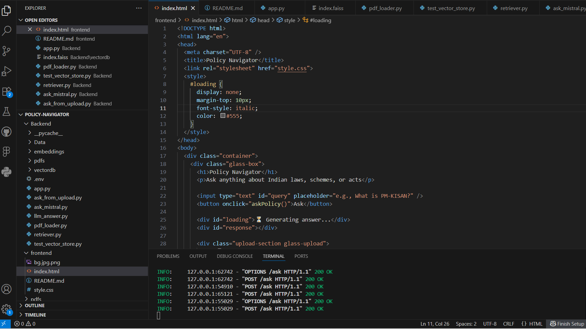
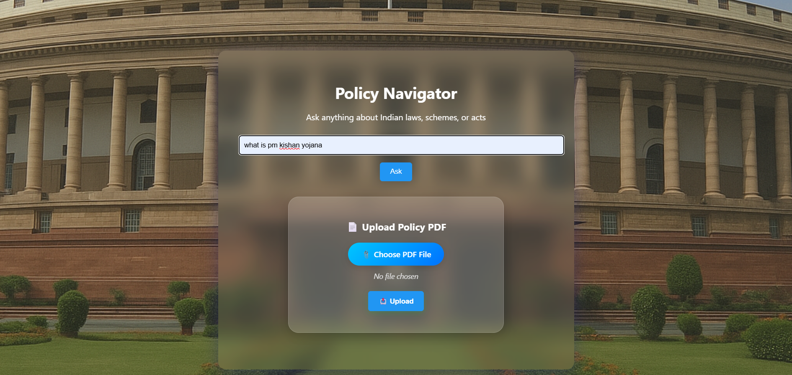
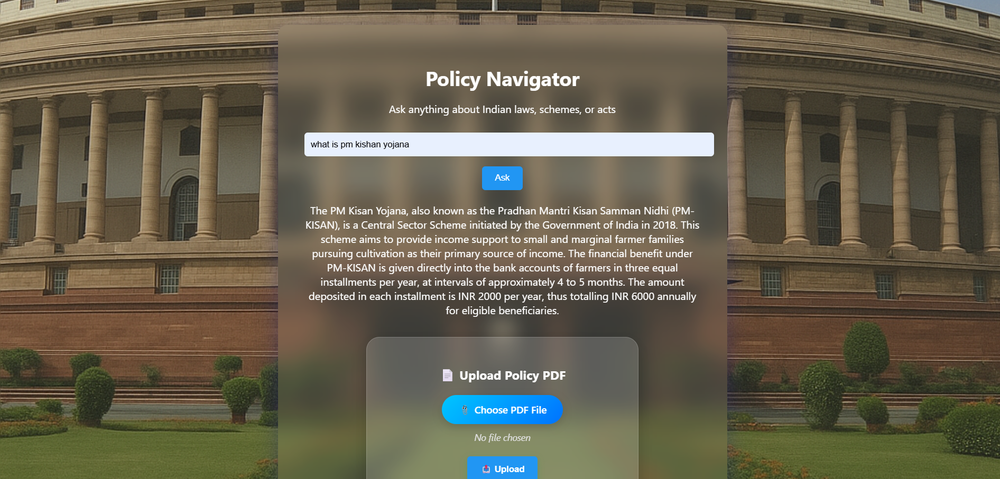
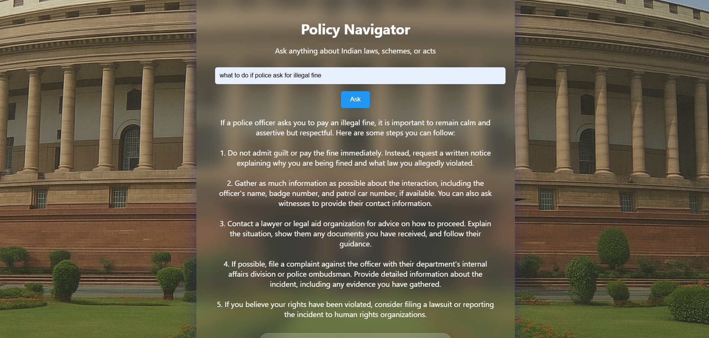

# 🧠 AI Policy Navigator (Chatbot)

An **AI-powered Policy Navigator Chatbot** that helps users **search, understand, and analyze complex policy documents** using **natural language queries**. The system uses **Ollama Mistral** for intelligent text comprehension and summarization, making policy research faster and more accessible.

---

## 🚀 Features

- 💬 Interactive **AI Chatbot** for policy-related queries  
- 📄 **PDF upload & parsing** to extract key information from documents  
- 🧩 **Context-aware responses** based on document content  
- ⚡ Built with **FastAPI** for a fast and scalable backend  
- 🌐 Simple and responsive web interface using **HTML, CSS, and JavaScript**  
- ☁️ Ready for deployment on any cloud or Docker environment  

---

## 🛠️ Tech Stack

| Category | Technologies Used |
|-----------|------------------|
| **Backend** | FastAPI, Python |
| **AI/NLP** | Ollama Mistral |
| **Frontend** | HTML, CSS, JavaScript |
| **PDF Processing** | PyMuPDF / pdfplumber |
| **Deployment** | Docker / Cloud (optional) |

# AI-POLICY NAVIGATOR

## Screenshots

### Code Setup

### Policies

